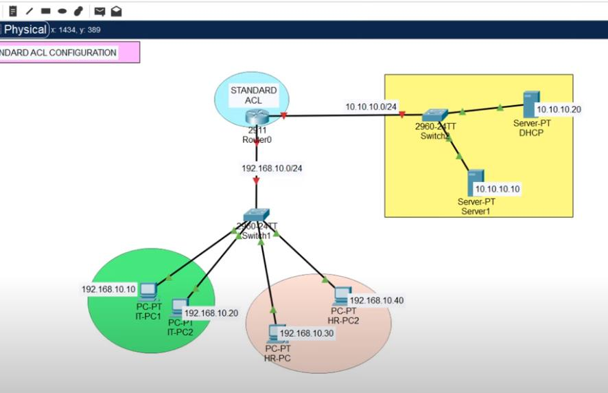
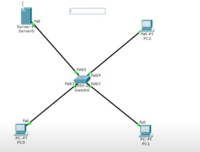
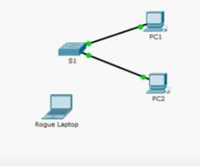
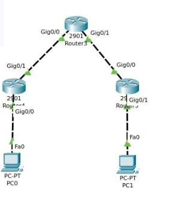
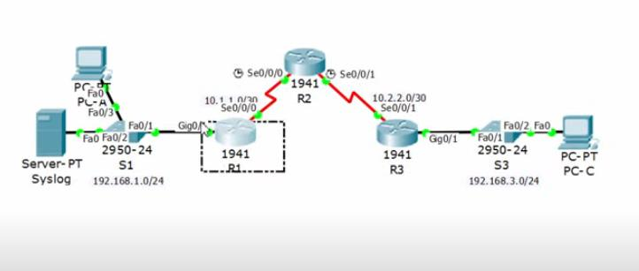
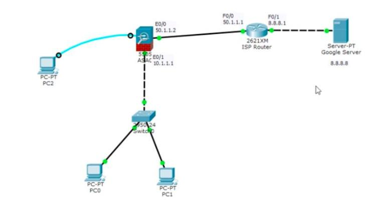

# Cisco Network Security Labs (Packet Tracer)

Hands-on Cisco Packet Tracer labs covering ACLs, port security, GRE VPN tunnels, IOS IPS, and ASA firewall configuration. Each section includes topology, configuration commands, and expected results.

📄 [Full original lab notes (PDF)](./CPT_PDF.pdf)

---

## 1. Standard ACL

**Topology:** Router0 connects an IT VLAN (`192.168.10.10`, `192.168.10.20`) and HR VLAN (`192.168.10.30`, `192.168.10.40`) to a server segment (`10.10.10.0/24`) with a DHCP server and Server1.

**Goal:** Prevent the HR PC from accessing the servers.

```
en
configure terminal
access-list 10 permit host 192.168.10.10
access-list 10 permit host 192.168.10.20
access-list 10 deny any

! Bind to the router interface facing HR/IT
interface gig0/1
ip access-group 10 in

! Verify
show access-lists
```

**Test:** Ping from IT PCs to server (should succeed) and from HR PC to server (should fail).



---

## 2. Extended ACL

Same topology as above, using an extended ACL (number range 100–199) for more granular filtering — only IT is permitted to reach the DHCP server.

```
en
configure terminal
access-list 120 permit ip 192.168.10.10 0.0.0.255 10.10.10.20 0.0.0.255
access-list 120 permit ip 192.168.10.20 0.0.0.255 10.10.10.20 0.0.0.255
access-list 120 deny ip any any

interface gig0/1
ip access-group 120 in

show access-lists
```

> Note: extended ACLs use wildcard masks (e.g. `0.0.0.255`), not subnet masks.


---

## 3. Server-Side Firewall (ICMP filtering)

**Topology:** A single switch connecting Server0, PC0, PC1, and PC2.

Enable the server's built-in firewall and block ICMP while allowing IP:

```
Server > Firewall > On
Deny: ICMP  for 0.0.0.0 mask 255.255.255.255
Allow: IP   for 0.0.0.0 mask 255.255.255.255
```

**Result:**
- `ping <server>` from a PC → fails (ICMP blocked)
- Browsing to the server (HTTP, e.g. `http://1.0.0.1`) from the same PC → works (IP/TCP still allowed)



---

## 4. Port Security

**Topology:** Switch S1 with PC1 and PC2 connected, plus a "rogue laptop" used to simulate an unauthorized device.



```
en
configure terminal
interface range fastEthernet 0/1-2
 switchport port-security maximum 1
 switchport port-security mac-address sticky
 switchport port-security violation restrict

! Shut down all unused ports
interface range fastEthernet 0/3-24, gigabitEthernet 0/1-2
 shutdown
```

**Test procedure:**
1. Ping PC1 ↔ PC2 — confirm baseline connectivity.
2. Connect the rogue laptop, enable its port, and ping — should work until port security kicks in.
   ```
   interface fastEthernet 0/3
   no shutdown
   ```
3. Move PC2's cable to the rogue laptop's port and try to ping — **fails**, since the port learned PC2's MAC via sticky learning and now sees a different device.
4. Verify:
   ```
   show running-config
   show port-security interface fastEthernet 0/2
   ```


---

## 5. Site-to-Site VPN (GRE Tunnel)

**Topology:** Router3 (hub) connects to Router4 and Router5, each with a PC behind it (PC0, PC1).

```
! Enable RIP routing first, then on Router4:
configure terminal
interface tunnel 10
 ip address 172.16.1.1 255.255.0.0
 tunnel source Gig0/1
 tunnel destination 2.0.0.1
 no shutdown
exit

! Verify
ping 172.16.1.1
show interface tunnel 10
show interface tunnel 20
```



---

## 6. IOS IPS (Intrusion Prevention System)

**Topology:** PC-A → S1 → R1 → R2 → R3 → S3 → PC-C, with a syslog server attached to S1.

```
! Enable security license
configure terminal
license boot module c1900 technology-package securityk9
yes
do reload

! After reload — create IPS config directory and enable
enable
mkdir ipsdir
configure terminal
ip ips config location ipsdir
ip ips name iosips
ip ips signature-category
 category all
  retired true
 category ios_ips basic
  retired false
exit

interface g0/1
 ip ips iosips out
exit

! Send IPS logs to syslog server
logging host 192.168.1.50
service timestamps log datetime msec

! Tune a specific signature
ip ips signature-definition
 signature 2004 0
  status
   retired false
   enabled true
  engine
   event-action produce-alert
   event-action deny-packet-inline

show ip ips all
```

**Expected result:** Traffic from inside → outside works normally; traffic matching the tuned signature from outside → inside is dropped and alerted (visible in the syslog server).



---

## 7. ASA Firewall

**Topology:** PC2 (management) and an internal LAN (PC0, PC1 via switch) behind an ASA 5505, with an ISP router providing internet access to a "Google" server (`8.8.8.8`).

### Interfaces
```
configure terminal
interface vlan 1
 ip address 10.1.1.1 255.0.0.0
 no shutdown
 nameif inside
 security-level 100
exit

interface e0/1
 switchport access vlan 1
exit

interface vlan 2
 ip address 50.1.1.2 255.0.0.0
 no shutdown
 nameif outside
 security-level 0
exit

interface e0/0
 switchport access vlan 2
exit
```

### DHCP for internal PCs
```
configure terminal
dhcpd address 10.1.1.10-10.1.1.30 inside
dhcpd dns 8.8.8.8 interface inside
```

### Default route + NAT
```
route outside 0.0.0.0 0.0.0.0 50.1.1.1

! On the upstream router
router ospf 1
 network 50.0.0.0 0.255.255.255 area 0
 network 0.0.0.0 0.255.255.255 area 0

! On the ASA
object network LAN
 subnet 10.0.0.0 255.0.0.0
nat (inside,outside) dynamic interface
```

### Allow inbound traffic (test only — outside-in ping/tcp)
```
configure terminal
access-list uti extended permit tcp any any
access-list uti extended permit icmp any any
access-group uti in interface outside
```

### Verification
```
show xlate
show nat
```

**Test flow:**
1. Before the `access-list uti` rule: `ping -t 8.8.8.8` from PC1/PC2 gets no reply (default ASA behavior blocks unsolicited inbound).
2. After applying the ACL: both PCs get replies.




