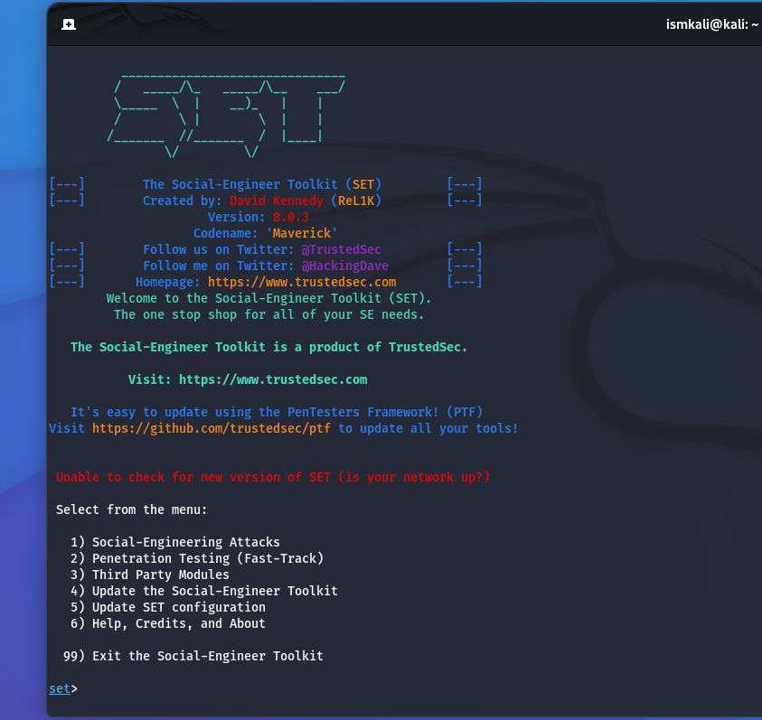

# Social Engineering Attack Vectors: Overview & Defense

Coursework summary covering five categories of social engineering attacks demonstrated in a controlled lab environment using the Kali Linux Social-Engineer Toolkit (SET). Focus is on how each attack works conceptually and how to defend against it. Reproducible attack steps and payload details are left out here; this is a defensive/awareness reference, not an execution guide.

The Social-Engineer Toolkit (SET) is an open-source penetration testing framework built by TrustedSec, focused on the human element of security rather than technical exploits. It's used in authorized red-team and awareness training exercises to show how easily trust can be exploited.

---

## 1. Phishing (Credential Harvesting)

**Concept:** An attacker clones a legitimate login page (e.g. an email or SSO provider) and hosts it somewhere the victim is tricked into visiting. When the victim enters credentials, they're captured before being forwarded to the real site.

**Why it works:** Visual trust. People rarely check the URL bar or certificate when a page looks identical to the real one.

**Defense:**
- Enable MFA everywhere possible so a captured password alone isn't enough
- Use a password manager, which won't autofill credentials on a lookalike domain
- Train users to check the URL/domain before entering credentials, not just the page design
- Deploy email/web filtering that flags newly registered or lookalike domains

---

## 2. Infectious Media Generator (Malicious USB/Media Drops)

**Concept:** Malicious executables are placed on removable media (USB drives, CDs) left where a target is likely to find and plug them in, a classic "found USB" pretext.

**Why it works:** Curiosity and helpfulness. People often plug in unknown drives to identify the owner or out of curiosity.

**Defense:**
- Disable AutoRun/AutoPlay via Group Policy on all managed endpoints
- Enforce USB device control (allowlisting known devices, blocking unknown mass storage)
- Security awareness training on "found media": treat any unknown drive as hostile
- Endpoint detection (EDR) to catch payload execution behavior even if a device is inserted

---

## 3. Mass Mailer Attack (Spoofed Bulk Phishing Email)

**Concept:** Attackers send large volumes of emails crafted to look like they come from a legitimate source, aiming to get recipients to click a link or open an attachment.

**Why it works:** Volume plus urgency or authority framing. Even a low click-through rate across thousands of emails is a win for the attacker.

**Defense:**
- Enforce SPF, DKIM, and DMARC to make sender spoofing much harder
- Email gateway filtering with attachment sandboxing
- Regular phishing-simulation training so users recognize red flags (urgency, unexpected sender, mismatched links)
- Report-phishing button/workflow so one flagged email protects the rest of the org

---

## 4. QR Code Attack Vectors

**Concept:** A malicious URL is encoded into a QR code and distributed physically (posters, flyers) or digitally. Scanning redirects the victim to a phishing page or triggers a download.

**Why it works:** QR codes hide the destination URL until after the user has already scanned. Trust is placed in the physical context (a poster, a menu) rather than the link itself.

**Defense:**
- Use a QR scanner/browser that previews the destination URL before navigating
- Be skeptical of QR codes in public or unverified physical locations, especially ones layered over existing signage
- Mobile device management (MDM) with safe-browsing/URL filtering enabled
- Organizational policy: never scan QR codes for logins or payments from unofficial sources

---

## 5. PowerShell Reverse Shell

**Concept:** A PowerShell script is crafted to open an outbound connection from the victim's machine back to an attacker-controlled listener, giving remote command execution once run.

**Why it works:** PowerShell is trusted and built into Windows by default, so malicious scripts can blend in with legitimate admin activity and often evade signature-based antivirus.

**Defense:**
- Enforce PowerShell Constrained Language Mode and script execution policies org-wide
- Enable PowerShell script block logging and ship logs to a SIEM for anomaly detection
- Application allowlisting (e.g. AppLocker/WDAC) to restrict what can execute
- Network egress filtering so unexpected outbound connections on unusual ports get flagged/blocked
- Disable or tightly control PowerShell for users who don't need it

---

## Key Takeaway

All five vectors above exploit trust and habit rather than a technical vulnerability, which is why technical controls alone (firewalls, AV) aren't sufficient. The strongest defense layer is consistent, realistic security awareness training combined with the technical controls listed above: MFA, email authentication, device control, logging, and execution restrictions.

---

📄 [Full lab writeup (PDF)](./SE_tool_kit.pdf)
