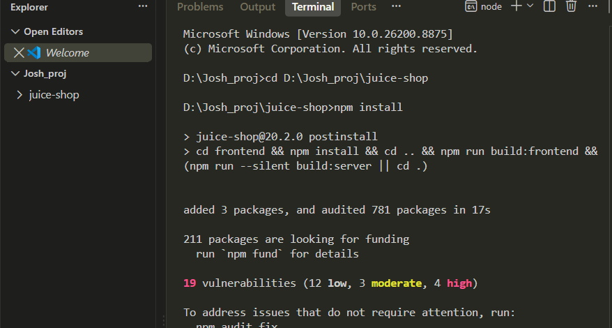
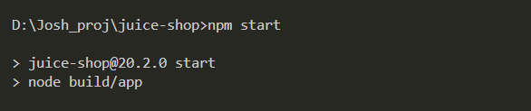
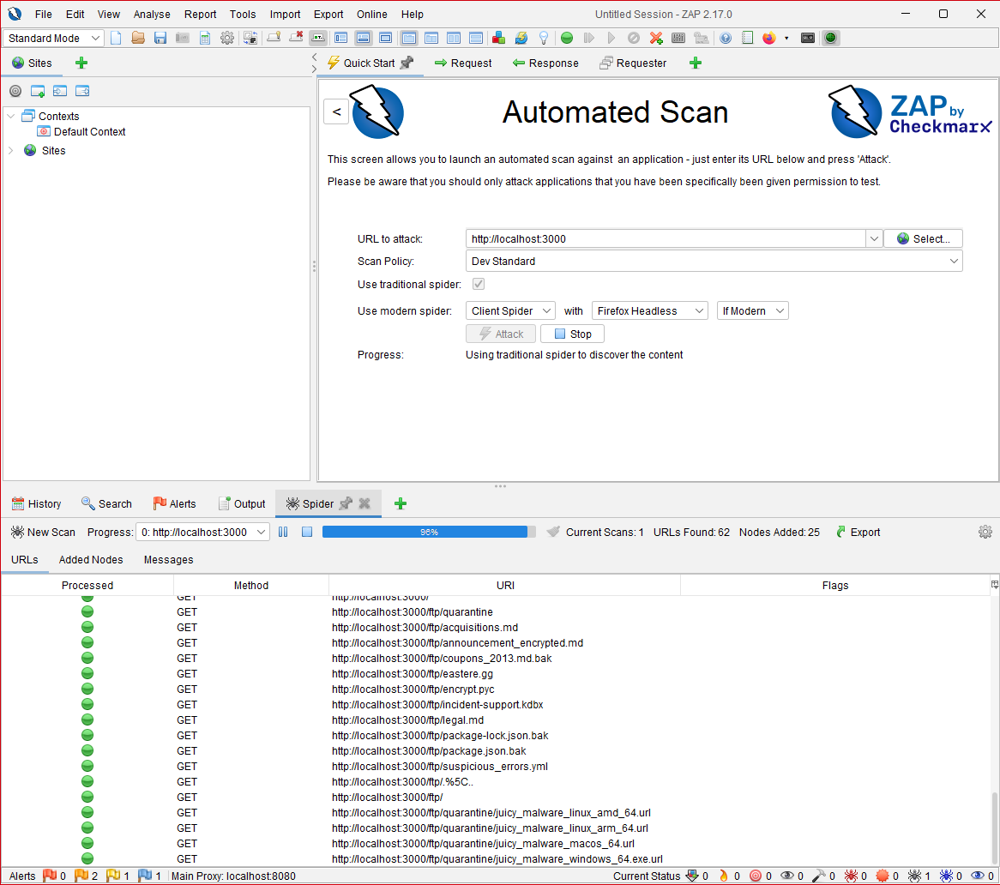

# OWASP Juice Shop — Automated DAST Scan with OWASP ZAP

Web application vulnerability assessment of OWASP Juice Shop, an intentionally vulnerable application maintained by OWASP for security training and tool validation. The app was deployed locally and assessed using OWASP ZAP (Zed Attack Proxy), an industry-standard Dynamic Application Security Testing (DAST) tool.

📄 [Full assessment writeup (PDF)](./juice_shop-zap.pdf)

---

## Executive Summary

The automated scan identified **31 findings**: 1 High-risk issue, 12 Medium-risk, and 18 Low/Informational-risk. The dominant theme is weak or missing HTTP security headers, most notably an absent or overly permissive Content Security Policy (CSP), alongside cross-domain misconfiguration and insecure cookie/session handling. Individually most findings are Low-to-Medium severity, but collectively they widen the application's attack surface, particularly against client-side attacks like XSS and clickjacking.

| Risk | Count |
|---|---|
| High | 1 |
| Medium | 12 |
| Low / Informational | 18 |

---

## Scope & Methodology

**Target**
- Application: OWASP Juice Shop v20.2.0, deployed locally at `http://localhost:3000`
- Environment: a deliberately vulnerable application, assessed under authorized, self-hosted conditions, the ethical and legal way to run this kind of scan without touching third-party systems.

**Tooling**
- Scanner: OWASP ZAP v2.17.0, a free, open-source DAST proxy (the open-source counterpart to Burp Suite)
- Technique: Automated Scan (spider + active scan), Dev Standard policy

**Approach**
The target was stood up locally via Node.js. ZAP was pointed at the running instance to spider the application (discovering pages and endpoints) and perform an active scan (probing discovered inputs for vulnerabilities). Findings were reviewed, categorized by risk, and exported into a formal report.

---

## Assessment Workflow

1. **Stand up the target** – Juice Shop cloned and launched locally with Node.js, exposing the app at `localhost:3000`
2. **Configure the scanner** – ZAP set to target the local instance using the Dev Standard scan policy
3. **Spider the application** – ZAP crawled the app to map its URLs and endpoints (62 URLs discovered)
4. **Active scan** – ZAP probed the discovered inputs with attack payloads to detect vulnerabilities
5. **Triage findings** – alerts reviewed and grouped by risk and confidence level
6. **Report** – a formal findings report generated and interpreted

---

## Evidence — Environment Setup

*Cloning and installing Juice Shop locally via npm (Node.js)*

*Launching the application (`npm start`), serving on localhost:3000*

---

## Evidence — Scanning

*OWASP ZAP spidering the running Juice Shop instance during the automated scan (62 URLs found)*

---

## Findings

### High Risk

| Finding | Risk | Instances |
|---|---|---|
| Off-site Redirect | High | 1 |

The application can be induced to redirect users to an external, attacker-controlled destination via a manipulated parameter. This enables convincing phishing attacks, since the link appears to originate from the trusted site before bouncing the victim elsewhere.

**Remediation:** validate redirect targets against an allow-list of trusted destinations rather than trusting user-supplied URLs.

### Medium Risk

| Finding | Risk | Instances |
|---|---|---|
| CSP: Failure to Define Directive with No Fallback | Medium | 11 |
| CSP: Wildcard Directive | Medium | 10 |
| CSP: script-src unsafe-eval | Medium | 6 |
| CSP: script-src unsafe-inline | Medium | 8 |
| CSP: style-src unsafe-inline | Medium | 16 |
| Content Security Policy (CSP) Header Not Set | Medium | 5 |
| Cross-Domain Misconfiguration | Medium | 29 |
| Missing Anti-clickjacking Header | Medium | 1 |
| Session ID in URL Rewrite | Medium | 5 |
| Sub Resource Integrity Attribute Missing | Medium | 7 |

The Medium-risk findings are dominated by Content Security Policy (CSP) weaknesses and cross-domain misconfiguration. CSP is an HTTP response header that instructs the browser which sources of script, style, and content are trusted; when it's missing, undefined, or uses wildcards / `unsafe-inline` / `unsafe-eval`, the browser loses a key line of defense against XSS. Cross-Domain Misconfiguration (present on 29 responses) indicates overly permissive resource-sharing settings. Session ID in URL Rewrite and the missing anti-clickjacking header round out the higher-impact configuration gaps.

### Low & Informational Risk (selected)

| Finding | Risk | Instances |
|---|---|---|
| Application Error Disclosure | Low | 1 |
| Cookie No HttpOnly Flag | Low | 1 |
| Cookie without SameSite Attribute | Low | 1 |
| Cross-Domain JavaScript Source File Inclusion | Low | 7 |
| Private IP Disclosure | Low | 3 |
| Server Leaks Version Information (Server Header) | Low | 6 |
| Strict-Transport-Security Header Not Set | Low | 11 |
| Timestamp Disclosure - Unix | Low | 16 |
| X-Content-Type-Options Header Missing | Low | 10 |

These are largely defense-in-depth and information-hygiene issues: missing security headers (HSTS, X-Content-Type-Options), insecure cookie flags (HttpOnly, SameSite), version-information leakage, and timestamp/private-IP disclosure. Individually low-impact, but each removes a small barrier or hands an attacker useful reconnaissance.

---

## Key Themes & Recommendations

- **Harden HTTP security headers** – implement a strict Content Security Policy: define `script-src` / `style-src` explicitly, remove wildcards and `unsafe-inline` / `unsafe-eval`. This is the single highest-leverage fix and addresses the largest cluster of findings.
- **Fix cross-domain configuration** – restrict cross-origin resource sharing to only the origins that genuinely need it, rather than permissive defaults.
- **Secure session & cookie handling** – set `HttpOnly` and `SameSite` on cookies, and stop passing session identifiers in URLs (use secure cookies instead).
- **Validate redirects** – allow-list redirect destinations to close the off-site redirect (phishing) vector.
- **Reduce information disclosure** – suppress server version headers and verbose error output to reduce reconnaissance value to an attacker.

---

## Limitations & Next Steps

This assessment used automated DAST scanning, which provides broad coverage of common, signature-detectable issues but has known limits on modern single-page applications like Juice Shop, much of its functionality is JavaScript-driven API calls that an automated spider doesn't fully reach. As a result, the deeper application-logic vulnerabilities Juice Shop is known for (SQL injection, broken access control, authentication flaws) are under-represented in an automated-only scan.

Next steps to deepen the assessment:
1. Browse the application through the ZAP proxy to capture API endpoints before re-scanning, improving coverage
2. Run the Ajax Spider for better SPA crawling
3. Perform manual testing with an intercepting proxy to probe access-control and injection flaws that automation misses

A complete engagement combines automated breadth with manual depth.

---

📄 Full technical detail, including every affected URL, request/response evidence, and per-alert remediation guidance, is available in the accompanying ZAP HTML/PDF report: [ZAP Scanning Report (PDF)](./ZAP_Scanning_Report.pdf)
