# Nmap Network Scanning & Reconnaissance

Cyber Security coursework covering IP reconnaissance and a range of Nmap scan types, run via Zenmap (Nmap's GUI), against target hosts. Covers TCP scanning techniques, OS/service fingerprinting, and web vulnerability detection scripts (NSE).

---

## 1. IP Lookup via Netcraft

Before scanning, the target's IP address was identified using the Netcraft browser extension, which reports hosting, DNS, and network ownership details for a domain.

**Target:** google.com

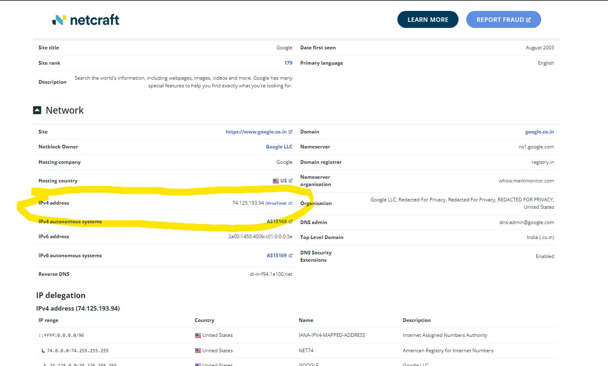

---

## 2. Nmap Scans

### 2.1 TCP Connect Scan
Completes the full TCP three-way handshake with each port, the most reliable scan type but also the most detectable.

```
nmap -sT 74.125.193.94
```

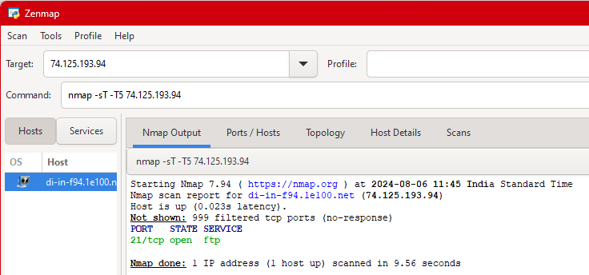

---

### 2.2 TCP Half-Open (SYN) Scan
Sends a SYN packet and reads the response without completing the handshake, faster and stealthier than a full connect scan.

```
nmap -sS 74.125.193.94
```

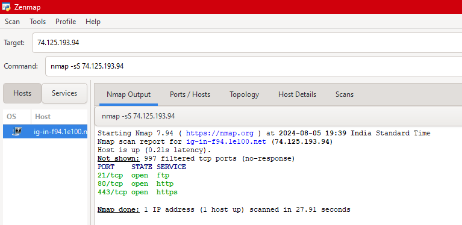

---

### 2.3 Xmas Scan
Sends packets with the FIN, PSH, and URG flags all set (lighting up the packet like a "Christmas tree"). Used to infer port state based on how a target responds (or doesn't) to malformed flag combinations.

```
nmap -sX 74.125.193.94
```

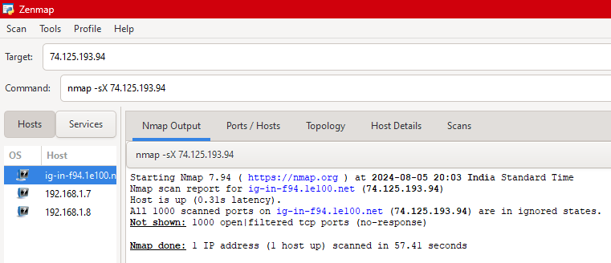

---

### 2.4 FIN Scan
Sends a packet with only the FIN flag set. Closed ports should respond with an RST, while open ports typically stay silent, useful for slipping past basic stateless firewalls.

```
nmap -sF 74.125.193.94
```

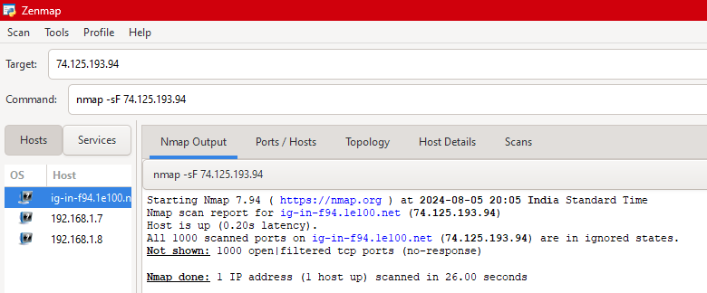

---

### 2.5 Banner Grabbing / Version Detection
Identifies the specific service and version running on each open port by analyzing responses, useful for spotting outdated or vulnerable software.

```
nmap -sV 74.125.193.94
```

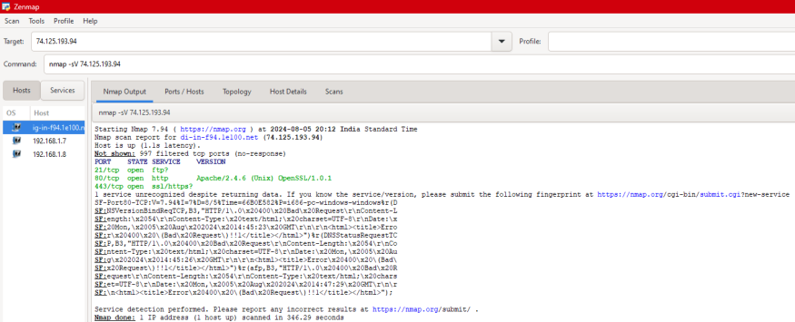

---

### 2.6 Ping Sweep
Checks which hosts in a list or range are up, without port scanning them, a quick way to map what's alive on a network before deeper scanning.

```
nmap -sn 74.125.193.94 192.168.1.7 192.168.1.8
```

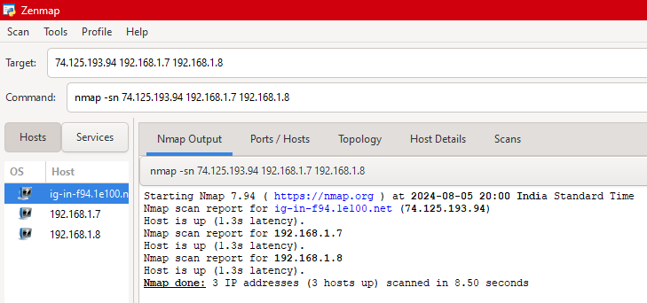

---

### 2.7 OS Detection
Attempts to fingerprint the target's operating system based on how its TCP/IP stack responds to specific probes.

```
nmap -O 87.121.150.33
```

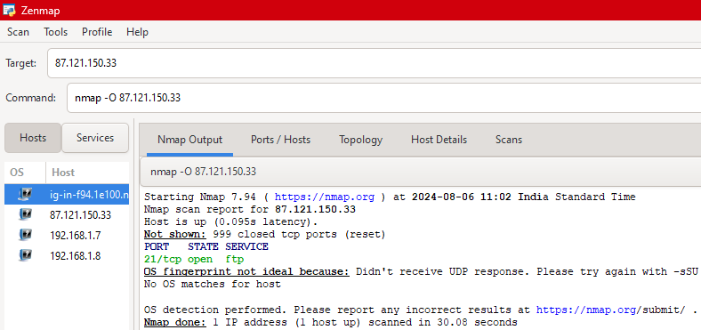

---

### 2.8 XSS Detection (NSE Script)
Uses Nmap's Scripting Engine (NSE) to check web ports for reflected cross-site scripting weaknesses.

```
nmap --script http-xssed.nse -p 80,443 87.121.150.33
```

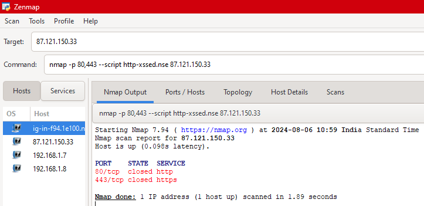

---

### 2.9 CSRF Detection (NSE Script)
Checks for missing CSRF protections on web forms/endpoints.

```
nmap -sV --script http-csrf 87.121.150.33
```

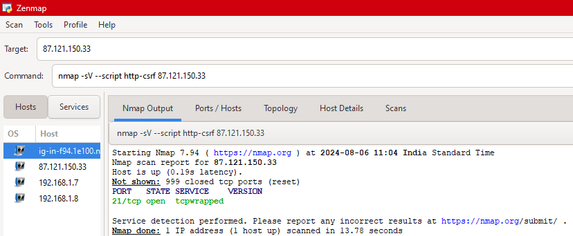

---

### 2.10 SQL Injection Detection (NSE Script)
Probes web endpoints for basic SQL injection indicators.

```
nmap -p 80,443 --script http-sql-injection.nse 87.121.150.33
```

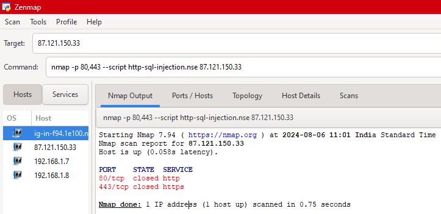

---

## Key Takeaway

Different scan types trade off speed, stealth, and reliability, SYN scans are fast and quieter than full connect scans, while FIN/Xmas scans can sometimes slip past simple packet filters that only watch for SYN packets. Banner grabbing and OS detection turn a basic "is this port open" scan into actionable intelligence about what's actually running, which is why keeping services patched and minimizing exposed ports/banners matters as a defensive measure. The NSE vulnerability scripts (XSS/CSRF/SQLi) show how the same reconnaissance tool can be extended into lightweight vulnerability scanning, useful both offensively and for a defender auditing their own exposure.

---

📄 [Full assignment writeup (PDF)](./nmap.pdf)
