# Wazuh SIEM Home Lab: Attack Simulation, Detection, and Automated Response

## Overview

This project covers building a Wazuh SIEM (Security Information and Event Management) lab on an Ubuntu server, then testing it against simulated attacker behavior. I used Atomic Red Team, a library of tests mapped to the MITRE ATT&CK framework, to generate real attack activity and confirm Wazuh could detect it, correctly tag it against known techniques, and automatically respond to a genuine threat by detecting and removing a malicious file through a VirusTotal integration.

## Environment

| Component | Role |
|---|---|
| Wazuh manager | Processes and analyzes logs |
| Wazuh indexer | Stores alert data |
| Wazuh dashboard | Web interface for viewing agents, alerts, and modules |
| Ubuntu server | Host for the Wazuh manager/indexer/dashboard |
| Atomic Red Team | Open-source library of MITRE ATT&CK-mapped test scripts |
| PowerShell + Invoke-AtomicRedTeam | Runs Atomic Red Team tests end to end |
| VirusTotal | Threat intelligence source, checks file hashes against 70+ AV engines |

## 1. Installing Wazuh

Wazuh was installed on an Ubuntu server as a single all-in-one deployment. The installer bundles the manager, indexer, and dashboard, and once it finished it printed the dashboard URL along with a generated admin username and password.

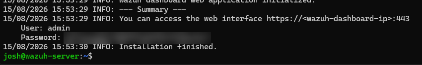

The password shown above is blurred since it's a live credential. Using it, I logged into the dashboard from a browser.

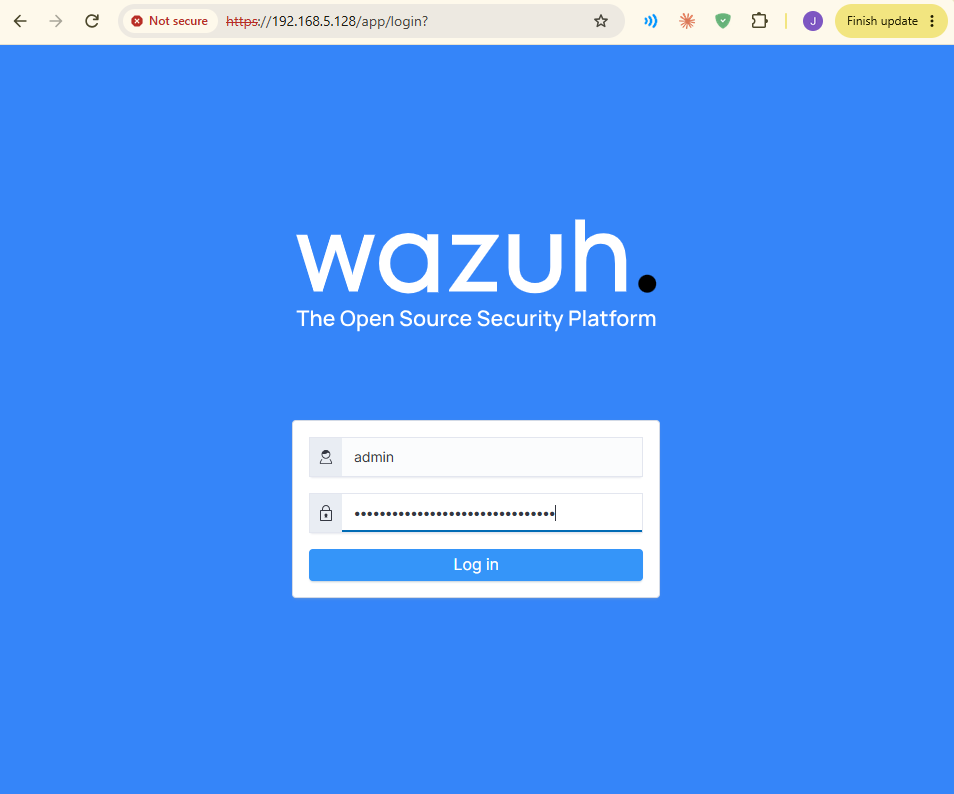

## 2. The Dashboard

The Overview page is the main landing screen. It shows a summary of connected agents and a breakdown of alerts from the last 24 hours by severity, along with shortcuts to Wazuh's individual security modules, including File Integrity Monitoring, MITRE ATT&CK, and VirusTotal, all used later in this project.

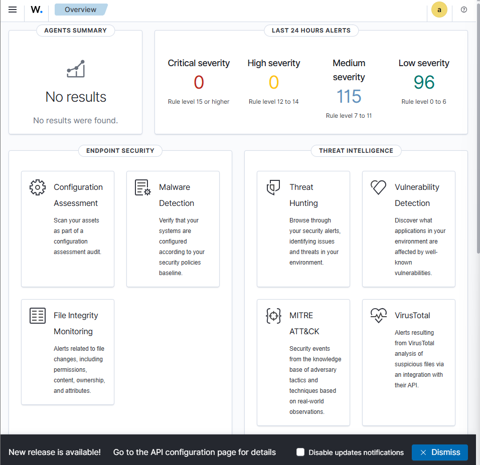

## 3. Setting Up Atomic Red Team

To test whether Wazuh actually detects attacks, I used Atomic Red Team, an open-source library of small, safe scripts that each simulate one specific MITRE ATT&CK technique.

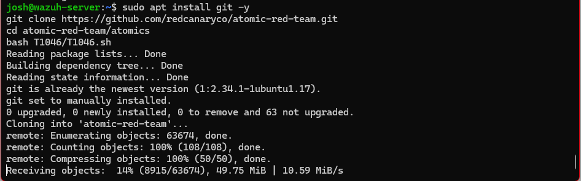

Rather than manually running each test, I installed PowerShell and the Invoke-AtomicRedTeam module, which runs a given technique end to end: it installs any prerequisites first, then executes the simulated attack.

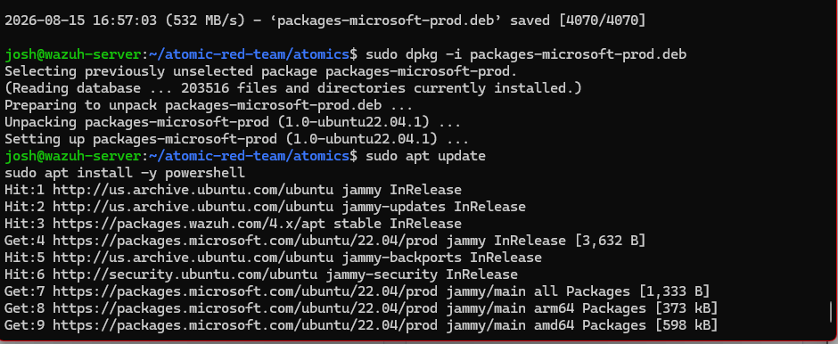

## 4. Simulating an Attack: Network Service Discovery (T1046)

The first test simulated MITRE technique T1046, Network Service Discovery, where an attacker scans a network to find open ports and running services, typically to map out what else is reachable after gaining initial access.

```powershell
Invoke-AtomicTest T1046 -TestNumbers 12 -GetPrereqs
Invoke-AtomicTest T1046 -TestNumbers 12
```

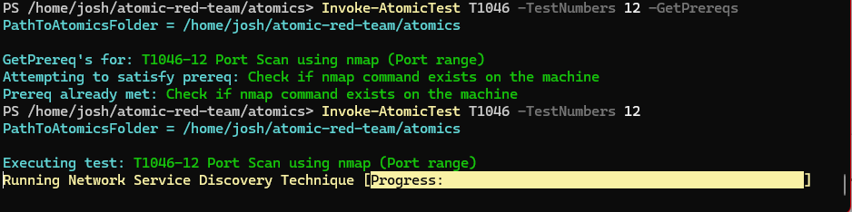

After the test ran, I checked the Wazuh dashboard and found six matching alerts. Wazuh had picked up the nmap package being installed and the scan itself being run with elevated (sudo) privileges.

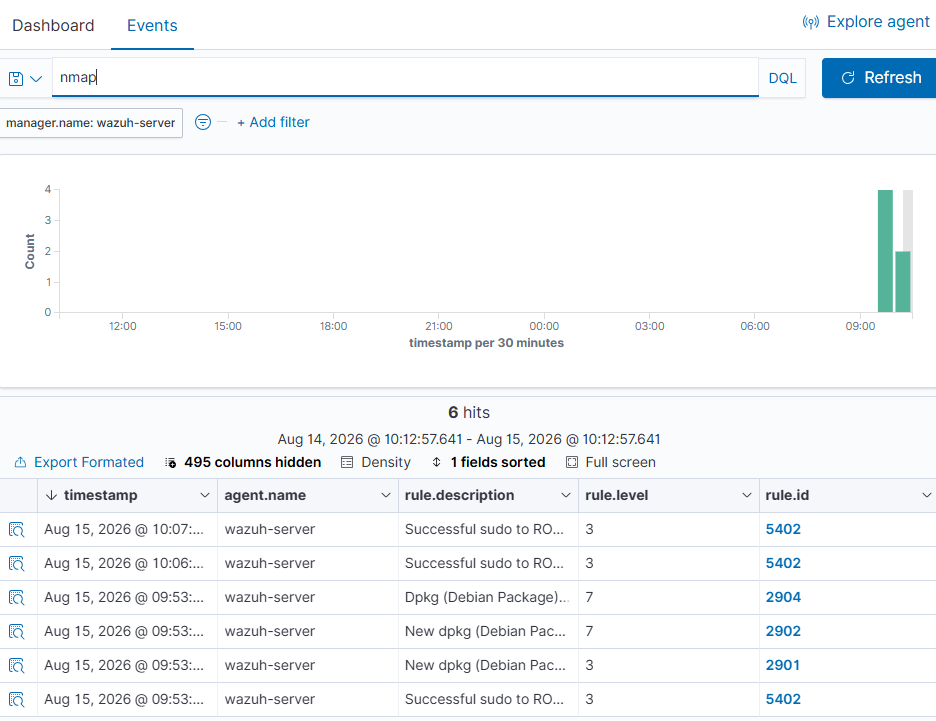

## 5. Mapping Detections to MITRE ATT&CK

Wazuh includes a dedicated MITRE ATT&CK module that automatically tags matching alerts with the relevant technique ID. Instead of manually figuring out what an alert means, you can see exactly which stage of an attack it corresponds to at a glance.

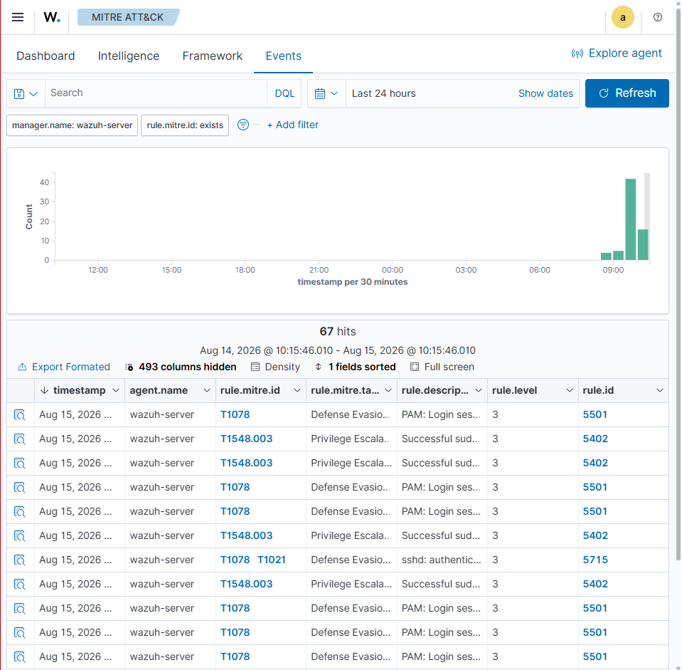

The module's dashboard view goes further, breaking detected activity down by tactic, the broader attacker goal behind a technique, such as Defense Evasion, Privilege Escalation, or Persistence.

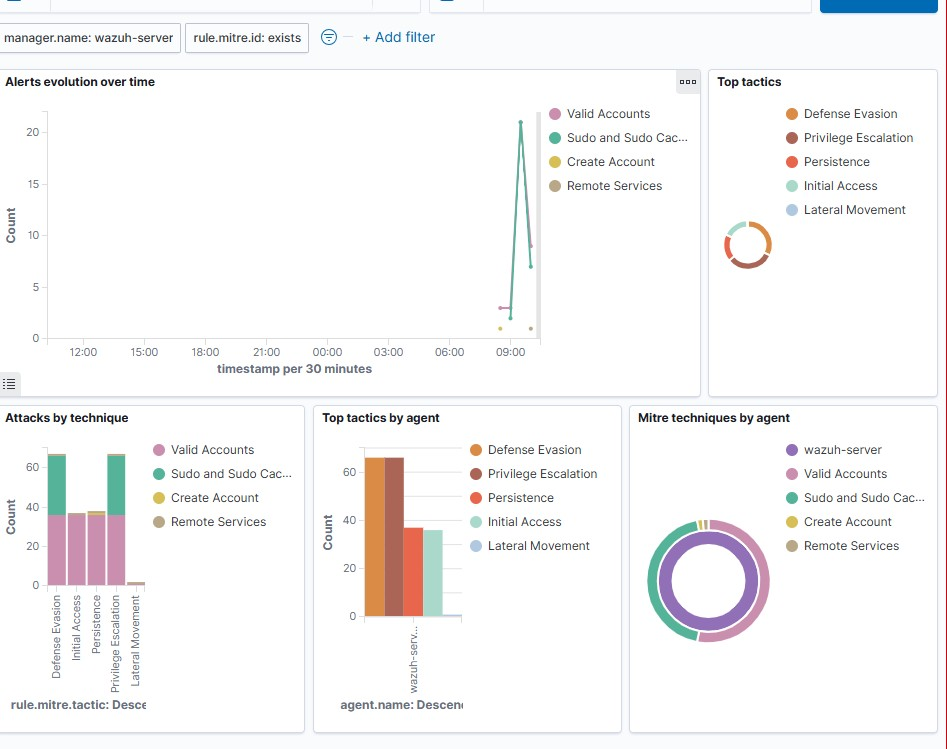

## 6. Setting Up File Integrity Monitoring (FIM)

Next, I configured Wazuh's File Integrity Monitoring to watch the Downloads folder in real time, so that any file added, changed, or deleted there would trigger an alert immediately instead of waiting for a scheduled scan.

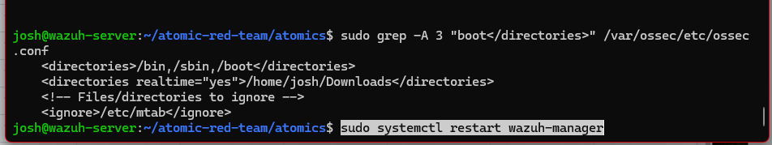

```bash
sudo grep -A 3 "boot</directories>" /var/ossec/etc/ossec.conf
sudo systemctl restart wazuh-manager
```

## 7. Connecting VirusTotal

On its own, FIM only knows that a file changed, not whether it's dangerous. To add that context, I connected a VirusTotal integration: whenever FIM detects a new file, Wazuh automatically checks that file's hash against VirusTotal's database of 70+ antivirus engines.

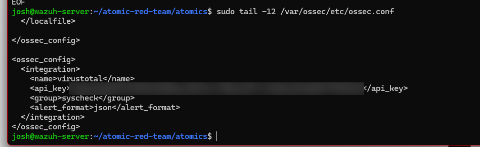

The API key is blurred in the screenshot above. It's not reproduced anywhere in this writeup.

## 8. Testing Detection With a Malicious File

To test the full pipeline, I dropped the EICAR test file into the Downloads folder. EICAR is a standard, harmless text string that every antivirus engine recognizes and flags as a test virus, used industry-wide for exactly this kind of testing. FIM picked it up right away.

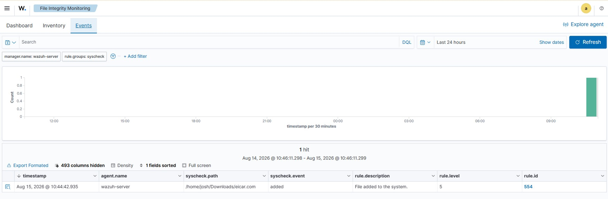

Seconds later, the VirusTotal integration returned its verdict: dozens of antivirus engines flagged the file as malicious, and Wazuh generated a high-severity alert for it.

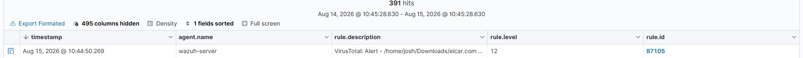

## 9. Automating the Response

Detection alone doesn't remove anything, so the last step was building an Active Response: a custom script tied specifically to Wazuh's "VirusTotal positive detection" rule, set to run automatically the moment that exact alert fires and delete the offending file.

```bash
sudo tee /var/ossec/active-response/bin/remove-threat.sh > /dev/null << 'EOF'
#!/bin/bash
read INPUT_JSON
FILENAME=$(echo "$INPUT_JSON" | jq -r '.parameters.alert.data.virustotal.source.file')
if [ -n "$FILENAME" ] && [ -f "$FILENAME" ]; then
    rm -f "$FILENAME"
    echo "$(date) Removed malicious file: $FILENAME" >> /var/ossec/logs/active-responses.log
fi
EOF

sudo chmod 750 /var/ossec/active-response/bin/remove-threat.sh
sudo chown root:wazuh /var/ossec/active-response/bin/remove-threat.sh
```

```xml
<command>
  <name>remove-threat</name>
  <executable>remove-threat.sh</executable>
  <timeout_allowed>no</timeout_allowed>
</command>

<active-response>
  <disabled>no</disabled>
  <command>remove-threat</command>
  <location>local</location>
  <rules_id>87105</rules_id>
</active-response>
```

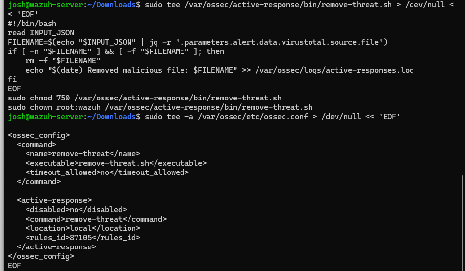

## 10. Confirming It Works

With the active response in place, I re-triggered the test. Wazuh's File Integrity Monitoring log shows the full cycle: the file being added, and moments later, the file being deleted, confirming the automated takedown worked end to end with no manual cleanup needed.

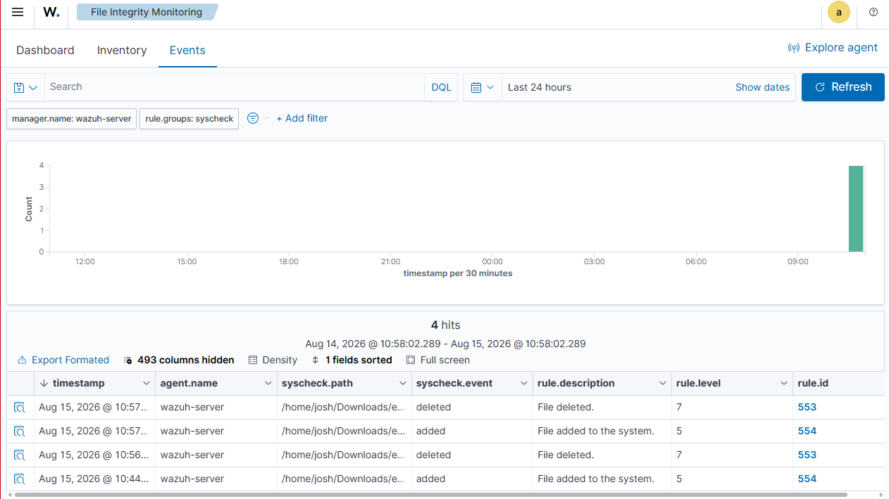

## Summary

This lab covered the full detection lifecycle: standing up a working Wazuh SIEM, simulating real attacker techniques through Atomic Red Team, confirming those techniques were correctly detected and mapped to MITRE ATT&CK, and building an automated response that identifies and removes a genuine threat without manual intervention.

## Key Techniques and Rules Referenced

| Item | ID | Purpose |
|---|---|---|
| Network Service Discovery | T1046 | Simulated attacker port/service scanning |
| VirusTotal positive detection | Rule 87105 | Triggers the active response |
| File added to the system | Rule 554 | FIM detects a new file |
| File deleted | Rule 553 | FIM confirms removal |

---

📄 [Full writeup (PDF)](./Wazuh_Home_Lab_Walkthrough.pdf)
